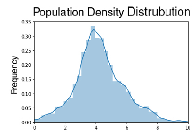

#Below is the Data Visualization obtained from my CoViD-19 Analysis Project.

##Above is the visualization of each feature and its importance in determining the number of cases.

Distribution of Population density in US counties.

Analysis of number of cases per day since the start of pandemic.

Distribution of cases per 1 Million.

Graphical Data visualization of dependence of each feature or factor responsible for the growth of CoViD-19. (Causal Graph)

Information about Data
For this project we use data related to the latest developments of the novel COVID19 in the United States. The visualization
summarizes the variables selected for understanding the causal mechanism for COVID19 pandemic. We collect demographic
data such as population density, how urban/rural a location is, and the fraction of elderly population. Similarly,
we collect some contextual data such as average temperature recorded previous week, number of international arrivals
and approximate number of days since the first case was seen. Finally, we include the number of confirmed cases per
1 million population as well as a proxy variable called transmission that reflects whether or not non-pharmaceutical
intervention policies were applied on the particular time.
The data is gathered from multiple sources compiled into a set of features for our model. The data related to demography
are gathered from the census data website. Flights data is taken from open sky network. The weather
data is compiled from the National Centers for Environmental Information website. Finally non pharmaceutical
intervention features are the data that include the policies such as school closures, religious gathering closures, social
distancing measures, and so on enforced by the authorities. These are gathered from Keystone Strategy.

